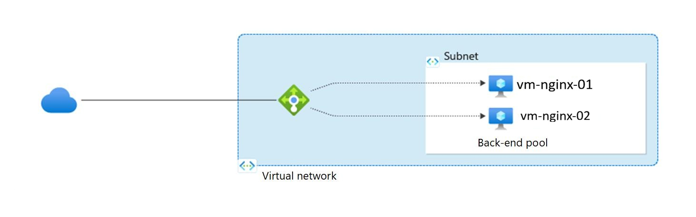
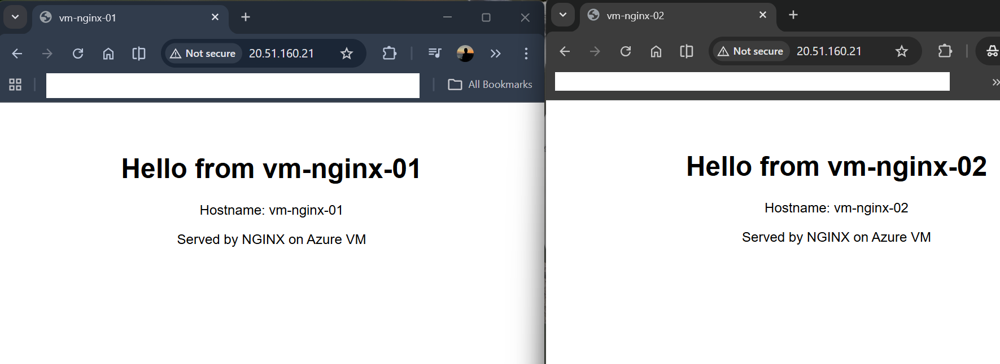

# Azure Load Balancer


This project demonstrates a highly available web application deployed on Microsoft Azure using Terraform.

---

## Architecture Diagram



---

## Architecture Overview

* Azure Virtual Network (VNet)
* Subnet (10.0.1.0/24)
* 2x Ubuntu Virtual Machines (Private IP only)
* Azure Load Balancer (Public)
* Backend Pool (VMs)
* Health Probe (HTTP:80)
* Load Balancing Rule (80 → 80)

---

## Result



---

## Deployment

```bash
cd terraform
terraform init
terraform apply
```

---

## Testing

```bash
curl http://<LOAD-BALANCER-PUBLIC-IP>
```

Loop test:

```bash
for i in {1..10}; do curl http://<LOAD-BALANCER-PUBLIC-IP>; echo; done
```

---

## 📁 Project Structure

```
terraform/   → Infrastructure as Code
images/      → Diagram & results
docs/        → Detailed architecture explanation
```

---

## Key Concepts

* Azure Load Balancer (Layer 4)
* Backend Pool & Health Probes
* Terraform Infrastructure as Code
* Custom Script Extension

---

## Future Improvements

* Replace VMs with VM Scale Set (VMSS)
* Add Azure Application Gateway (Layer 7)
* Enable HTTPS (SSL)
* Integrate Azure Monitor & Logging

---

## 👨‍💻 Author

Muktar Mohamed
Azure Cloud Engineer
