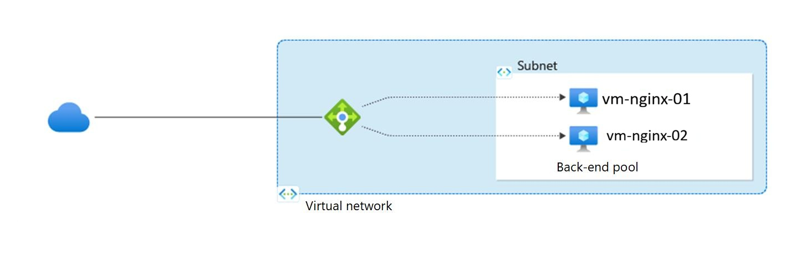

# Architecture Deep Dive — Azure Load Balancer High Availability Environment

---

## Architecture Diagram

---

## Overview

This project implements a highly available Azure web environment using Azure Load Balancer with private backend virtual machines running NGINX.

The design focuses on:

- High availability
- Backend isolation
- Health-based failover
- Secure network design
- Infrastructure automation using Terraform

---

## Traffic Flow

| Step | Description |
|---|---|
| 1 | Client sends HTTP request to Azure Load Balancer |
| 2 | Load Balancer checks backend VM health using HTTP probe |
| 3 | Traffic routed to healthy backend instance |
| 4 | NGINX serves client response |
| 5 | Unhealthy VM automatically removed from rotation |

---

## Architecture Components

### Azure Load Balancer

| Feature | Details |
|---|---|
| Type | Public Load Balancer |
| Layer | Layer 4 |
| Frontend | Public IP |
| Backend Pool | Multiple Ubuntu VMs |
| Distribution | TCP-based load balancing |

### Backend Virtual Machines

| VM | Private IP |
|---|---|
| `vm-nginx-01` | `10.0.1.10` |
| `vm-nginx-02` | `10.0.1.11` |

### Backend Configuration

- Ubuntu Linux
- NGINX installed automatically
- Connected through backend subnet only
- No direct public exposure

---

## Health Probe Configuration

| Setting | Value |
|---|---|
| Protocol | HTTP |
| Port | 80 |
| Path | `/` |
| Purpose | Detect unhealthy backend instances |

The health probe ensures traffic is routed only to healthy backend servers.

---

## Virtual Network Design

| Component | Configuration |
|---|---|
| Address Space | `10.0.0.0/16` |
| Backend Subnet | `10.0.1.0/24` |

The VNet isolates backend infrastructure and keeps internal resources separated from direct internet access.

---

## Network Security Controls

### NSG Configuration

| Rule | Purpose |
|---|---|
| Allow HTTP (80) | Allow web traffic through Load Balancer |
| Restrict unnecessary inbound access | Reduce attack surface |

### Security Design

- Backend VMs use private IP addresses only
- No direct SSH exposure from internet
- Internet traffic enters only through Load Balancer
- NSG controls access to backend subnet

---

## Infrastructure as Code

The environment was deployed using Terraform.

### Terraform Benefits

- Repeatable deployments
- Version-controlled infrastructure
- Consistent environment provisioning
- Easier infrastructure management

### Automated Components

- Virtual Network
- Subnets
- NSGs
- Public IP
- Azure Load Balancer
- Backend VM deployment
- Health probe configuration

---

## High Availability Design

| Feature | Purpose |
|---|---|
| Multiple backend VMs | Eliminate single point of failure |
| Load balancing | Distribute client traffic |
| Health probes | Detect unhealthy instances |
| Automatic failover | Maintain service availability |

---

## Design Decisions

### Why Azure Load Balancer?

- Native Azure service
- Highly available by design
- Simple and reliable Layer 4 load balancing
- Low operational overhead

### Why Private Backend VMs?

- Reduced external exposure
- Improved security posture
- Controlled entry point through Load Balancer

### Why Health Probes?

- Automatic unhealthy node detection
- Improves reliability
- Prevents failed instances from receiving traffic

---

## Future Enhancements

Planned improvements include:

- VM Scale Set integration
- Autoscaling configuration
- Azure Application Gateway deployment
- HTTPS and SSL/TLS implementation
- Azure Monitor integration
- Log Analytics workspace integration
- Web Application Firewall (WAF)

---

## Key Takeaways

- Demonstrates real-world Azure high availability design
- Combines networking, compute, and security concepts
- Uses Infrastructure as Code for repeatable deployment
- Shows practical Azure Load Balancer implementation
- Reinforces secure backend infrastructure design
